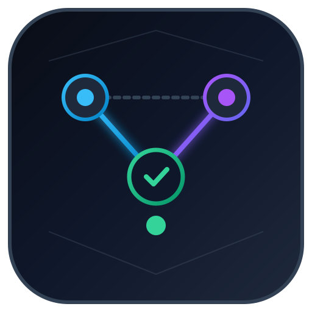
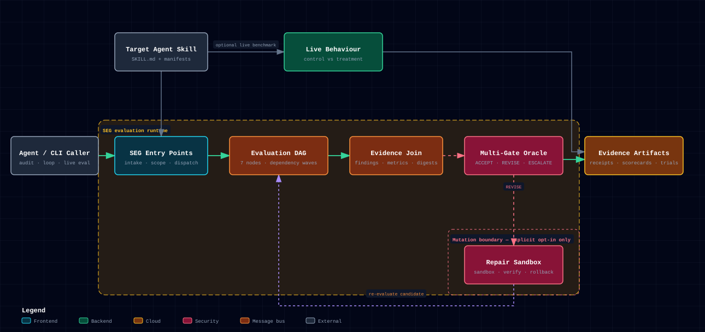

<p align="center">
  
</p>

# SEG: Skill Evaluation Graph

[](LICENSE)
[](https://github.com/MaxLaurieHutchinson/skill-evaluation-graph/actions/workflows/architecture.yml)

> **Evidence-driven evaluation for Agent Skills.**
>
> SEG combines deterministic static analysis, an executable Evaluation Graph, fail-closed gates, behavioural Control vs. Treatment trials, and bounded Repair Verification.

## Why SEG exists

A valid `SKILL.md` is not the same thing as a reliable skill.

SEG evaluates several independent concerns without allowing one good score to hide a critical failure:

- **Specification Conformance** — Agent Skills and configured host manifests.
- **Evaluation Integrity** — required Evaluators must complete successfully.
- **Safety & Privacy** — destructive commands and common workstation-path leaks.
- **Link Integrity** — relative references and package assets.
- **Static Quality** — deterministic heuristics for routing, structure, context efficiency, and maintainability.
- **Behavioural Reliability** — optional live Control vs. Treatment trials through a Harness Adapter.

**Gates own acceptance. Scores are supporting evidence.**

## Quick start

Run a deterministic evaluation:

```bash
python plugins/skill-evaluation-graph/scripts/audit_skill.py <path-to-skill>
```

Run the Evaluation Graph and bounded repair loop. This is read-only by default:

```bash
python plugins/skill-evaluation-graph/scripts/run_loop.py <path-to-skill> --target-score 95
```

Preview and then explicitly apply a verified Repair Candidate:

```bash
python plugins/skill-evaluation-graph/scripts/run_loop.py <path-to-skill> --apply
```

Run static behavioural policy analysis:

```bash
python plugins/skill-evaluation-graph/scripts/eval_skill.py <path-to-skill>
```

Run live Codex Control vs. Treatment trials:

```bash
python plugins/skill-evaluation-graph/scripts/eval_skill.py <path-to-skill> --live --harness codex --trials 3
```

## Runtime architecture



SEG's runtime is a real executable graph, not a diagram-shaped wrapper:

**Entry Points → Evaluation DAG → Evidence Join → Multi-Gate Oracle → Evidence Artifacts**

Two deliberate side paths keep different evidence classes separate:

- live Control vs. Treatment trials feed behavioural evidence into the artifact layer;
- `REVISE` enters a Repair Sandbox, verifies a candidate, then re-evaluates the DAG before any authorized mutation.

The dark static preview above is derived from the same validated model in [`docs/architecture/seg.architecture.json`](docs/architecture/seg.architecture.json). [Archify](https://github.com/tt-a1i/archify) remains the canonical renderer for release evidence: CI injects the exact repository URL and commit SHA into a temporary copy, regenerates the interactive HTML, and verifies both light and dark browser captures.

[Read the architecture guide](docs/architecture.md) · [Inspect the Archify source](docs/architecture/seg.architecture.json)

The default DAG executes independent Evaluators in waves, joins their Node Results into `JoinedEvidence`, and evaluates five mandatory gates:

1. `evaluation_integrity`
2. `specification_conformance`
3. `safety_privacy`
4. `link_integrity`
5. `quality_policy`

The Oracle returns exactly one canonical Verdict: `ACCEPT`, `REVISE`, or `ESCALATE`.

A separate `RunStatus` records what happened operationally, for example `COMPLETED`, `PREVIEWED`, `MUTATED`, or `ESCALATED`.

## Repair safety

SEG is read-only unless Mutation Authority is explicitly granted.

A Repair Proposal is staged in a temporary Repair Sandbox and evaluated as a Repair Candidate before target mutation. A candidate is rejected if it regresses a Mandatory Gate, introduces a new `ERROR`, or fails to produce measurable improvement. Authorized mutation uses a pre-mutation snapshot for rollback protection.

SEG describes this as **rollback-protected mutation**, not filesystem-atomic mutation.

## Behavioural evaluation

Static analysis can tell you whether instructions contain safeguards. It cannot prove an agent follows them.

Live behavioural mode runs the same versioned Behavioural Scenario in two arms:

- **Control Arm** — Target Skill not loaded.
- **Treatment Arm** — Target Skill loaded.

Trials record observable response evidence, compliance classification, latency, exit status, errors, and rationalisation markers. Harness/infrastructure failures are classified as `INVALID_TRIAL`; they are not counted as behavioural non-compliance.

The Codex Harness Adapter has been executed on a live authenticated host. That is **Live Host Tested**, not yet **Benchmark Verified**. Benchmark Verified is reserved for replicated experiments that demonstrate statistically meaningful uplift or variance reduction.

See [references/claim-audit.md](plugins/skill-evaluation-graph/references/claim-audit.md) for the evidence levels attached to capability claims.

## Installation

The public repository is compiled into a marketplace root plus the actual Skill/plugin package at:

```text
plugins/skill-evaluation-graph/
```

### OpenAI Codex

Use the repository marketplace through Codex/ChatGPT plugin administration or the Plugins UI. The exported repository contains:

```text
.agents/plugins/marketplace.json
plugins/skill-evaluation-graph/.codex-plugin/plugin.json
```

The marketplace points to `./plugins/skill-evaluation-graph` and is validated during CI.

For a plain Agent Skills installation, copy or link `plugins/skill-evaluation-graph` into an Agent Skills directory supported by your environment.

### Google Gemini CLI

Gemini CLI supports Agent Skills directly. Install the nested public Skill with:

```bash
gemini skills install https://github.com/MaxLaurieHutchinson/skill-evaluation-graph --path plugins/skill-evaluation-graph
```

SEG also includes `gemini-extension.json` for Gemini CLI extension compatibility. The extension manifest is evaluated as a **Gemini CLI** manifest; it is not treated as an Antigravity plugin manifest.

### Google Antigravity

Antigravity supports the Agent Skills standard directly. Install the exported Skill package into a supported skills directory, for example a workspace skill:

```text
<workspace-root>/.agents/skills/skill-evaluation-graph/
```

Copy the contents of `plugins/skill-evaluation-graph/` into that directory. Antigravity discovers `SKILL.md` and its bundled resources through the Agent Skills mechanism.

SEG does not claim that `gemini-extension.json` is an Antigravity plugin manifest.

### Anthropic Claude Code

The exported package includes `.claude-plugin/plugin.json`, `CLAUDE.md`, and hook metadata. Use the bundled directory `plugins/skill-evaluation-graph` with Claude Code's supported plugin/skill installation workflow for your environment.

## Packaging and portability evidence

SEG keeps three ideas separate:

| Concept | Meaning |
|:---|:---|
| **Packaging Evidence** | Whether the Target Skill's relevant manifest/package validates. |
| **Harness Capability** | Whether SEG itself has an Adapter for that Harness. |
| **Target Verification** | Whether this exact Target Skill has been exercised on the live Harness. |

A manifest passing validation does not mean the Target Skill was live tested. A SEG Harness Adapter existing does not mean every target is automatically verified.

## Evidence levels

Public capability claims use these levels:

1. **Implemented** — code exists.
2. **Unit Tested** — isolated tests with fixtures/mocks/synthetic inputs.
3. **Integration Tested** — subsystem boundaries exercised together.
4. **Live Host Tested** — executed against a real authenticated host CLI.
5. **Benchmark Verified** — replicated live trials demonstrate measured behavioural effect.

These levels are deliberately not interchangeable.

## Tamper-evident receipts

Evaluation receipts include deterministic SHA256 digests for the evaluated target tree, configuration, Node Results, Oracle decision, and final receipt payload. Generated artifacts such as scorecards are tracked separately so they do not silently change the target state that produced the evaluation evidence.

Receipts are **tamper-evident**. They are not digitally signed attestations or immutable storage.

## Context and token economics

SEG profiles the package using the **SEG Context Tier Model**:

1. discovery metadata;
2. the `SKILL.md` control plane;
3. on-demand references;
4. deterministic tools/scripts;
5. output assets/templates.

This is an SEG evaluation model, not an externally mandated five-tier Agent Skills specification. Thresholds such as a compact `SKILL.md` are SEG Recommendations unless an authoritative external specification says otherwise.

## Scorecards

`audit_skill.py --scorecard` projects evidence already measured by the Evaluation Graph and Oracle.

It does **not** infer a full 1–5 rubric score from a proxy such as line count or the absence of one static warning. Pillars that have not been fully evaluated are reported as `NOT EVALUATED` with the available static evidence shown separately.

## What's included

- `plugins/skill-evaluation-graph/src/seg/graph.py` — DAG execution and dependency handling.
- `plugins/skill-evaluation-graph/src/seg/oracle.py` — Evidence Join and fail-closed gates.
- `plugins/skill-evaluation-graph/src/seg/evaluators/` — independent static Evaluators.
- `plugins/skill-evaluation-graph/src/seg/behaviour/` — behavioural scenarios, runner, and Harness Adapters.
- `plugins/skill-evaluation-graph/src/seg/repair/` — Repair Proposal planning, sandboxing, verification, and rollback protection.
- `plugins/skill-evaluation-graph/src/seg/receipts.py` — deterministic tamper-evident receipts.
- `plugins/skill-evaluation-graph/scripts/audit_skill.py` — deterministic audit/reporting CLI over the canonical engine.
- `plugins/skill-evaluation-graph/scripts/run_loop.py` — bounded evaluation/repair loop.
- `plugins/skill-evaluation-graph/scripts/eval_skill.py` — static and live behavioural evaluation.
- `plugins/skill-evaluation-graph/scripts/export_public_repo.py` — clean public-release compiler and validator.
- `docs/architecture.md` — evidence-backed runtime architecture guide.
- `docs/architecture/seg.architecture.json` — reproducible Archify architecture source.
- `plugins/skill-evaluation-graph/references/terminology.md` — canonical SEG vocabulary.
- `plugins/skill-evaluation-graph/references/claim-audit.md` — evidence classification for public claims.

## Canonical vocabulary

SEG deliberately uses a small domain vocabulary. Important distinctions include:

- **Evidence** is an observation; a **Finding** interprets Evidence.
- A **Gate** evaluates one predicate; the **Oracle** evaluates Gates and returns a Verdict.
- **Evaluation Graph** is the acyclic evaluator DAG; **Repair Iteration** loops across Evaluation Passes.
- **Seam** is a substitutable/observable interface location; **Boundary** is a limit of authority, trust, or scope.
- **Static Quality Score** is a heuristic signal; it is not proof of Specification Conformance or Safety.

See [references/terminology.md](plugins/skill-evaluation-graph/references/terminology.md).

## Testing and release validation

```bash
python -m unittest discover -s plugins/skill-evaluation-graph/scripts
python plugins/skill-evaluation-graph/scripts/audit_skill.py plugins/skill-evaluation-graph --verbose
```

The workshop release pipeline runs the full unit/self-audit/export validation before publication. This public repository retains the architecture-evidence workflow, which validates the committed Archify source and regenerates its interactive/browser evidence artifact.

## Privacy

SEG has no project telemetry. Static evaluation processes user-selected files locally. Live Harness trials may send prompts or context to the configured external provider according to that provider's policies. See [PRIVACY.md](PRIVACY.md) for the exact boundary.

## Credits & inspiration

- **Andrew Ng & Stanford University** — agentic workflow and reflection concepts.
- **Austin Marchese** — graph-shape / wait-test inspiration used during SEG's early architecture exploration.
- **Jesse Vincent / Superpowers** — disciplined agent workflow and protective contributor-pattern inspiration.
- **Matt Pocock (`mattpocock/skills`)** — influence on canonical engineering vocabulary, reference-vs-driver separation, pre-agreed test seams, and primary-source evidence discipline.
- **Michael Feathers** — seam terminology for substitutable and observable interfaces.
- **Archify (`tt-a1i/archify`)** — deterministic architecture rendering, repository-evidence validation, and browser/composition checks for SEG's runtime model.

## Contributing

Before opening a PR:

```bash
python -m unittest discover -s plugins/skill-evaluation-graph/scripts
python plugins/skill-evaluation-graph/scripts/audit_skill.py plugins/skill-evaluation-graph --verbose
```

Use the vocabulary in [references/terminology.md](plugins/skill-evaluation-graph/references/terminology.md), keep external rules tied to the primary source that owns them, and do not promote evidence beyond the level actually demonstrated.

## License

MIT. See [LICENSE](LICENSE).

Copyright (c) 2026 Max Laurie Hutchinson.
