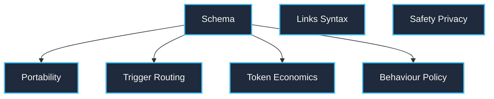

# SEG Evaluation Graph & Autonomous Evaluator Loop Design Specification

This specification documents the complete Directed Acyclic Graph (DAG) runtime architecture and autonomous evaluator loop control system for **Skill Evaluation Graph (SEG)**.

> [!IMPORTANT]
> **Canonical Terminology**: All concepts in this specification adhere strictly to [references/terminology.md](terminology.md).

---

## 1. Outcome & Authority Boundary

- **Component Name:** `seg-evaluator-loop` v1.0.0
- **User Outcome:** Transform any raw or failing Agent Skill into a verified, spec-compliant, and behaviorally resilient asset through bounded evaluation and verified sandboxed repair.
- **Run Identifier Format:** `audit-run-<skill_name>-<YYYYMMDD-HHMMSS>`
- **Inputs & Source of Truth:** Target skill directory containing `SKILL.md` and package resources (`references/`, `scripts/`, `assets/`, `.codex-plugin/`, `.claude-plugin/`, `.agents/`).
- **Authority Boundary:**
  - Default mode is strictly **Read-Only**.
  - Programmatic and CLI invocations default to inspecting diffs without disk mutation.
  - Disk mutation occurs **only** when explicitly authorized via `--apply` or programmatic `apply_mutations=True`.
  - Staging occurs in an isolated scratch sandbox (`RepairSandbox`) with `.seg_backup/` snapshots for rollback protection.
- **Iteration Ceiling:** Maximum 3 repair iterations by default.
- **Evaluation Gates:** Gate 0 (Integrity), Gate 1 (Specification), Gate 2 (Safety/Privacy), Gate 3 (Links), Gate 4 (Score $\ge 95$).

---

## 2. Complete Evaluation Graph Topology

The system integrates an intake stage, a parallel evaluator DAG executed in waves, deterministic evidence joining, a multi-gate Oracle, and an isolated repair verification loop:

```text
[Start: Target Skill Path]
          │
          ▼
[Node 1: Intake & Scope Verification] (Chain)
          │
          ▼
┌────────────────────────────────────────────────────────────────────────┐
│ NODE 2: PARALLEL EVALUATION GRAPH (Wave Execution)                     │
│                                                                        │
│ Wave 1 (Independent Evaluators Concurrent):                           │
│   ├── [schema]           YAML Frontmatter & Package Naming            │
│   ├── [links_syntax]     Relative Markdown Anchors & Asset Targets    │
│   └── [safety_privacy]   Secrets, Traversal, Injection & Shell PII    │
│                                                                        │
│ Wave 2 (Dependent Evaluators - Prerequisite: schema):                  │
│   ├── [portability]      Multi-Harness Manifests & Marketplace Schema │
│   ├── [trigger_routing]  Skill Discovery Optimization (SDO) Triggers │
│   ├── [token_economics]  Token Footprint & SEG Context Tier Budgets   │
│   └── [behaviour_policy] Anti-Rationalization & Red Flags             │
└──────────────────────────────────┬─────────────────────────────────────┘
                                   │
                                   ▼
[Node 3: Evidence Join (`synthesize_joined_evidence`)]
                                   │
                                   ▼
[Node 4: Multi-Gate Evaluator Oracle]
   ├── Gate 0 (evaluation_integrity): Evaluation Integrity Gate (Zero crashes, timeouts, or unexpected skips)
   ├── Gate 1 (specification_conformance): Specification Conformance Gate (Zero SPECIFICATION_ERROR findings)
   ├── Gate 2 (safety_privacy): Operational Safety & Privacy Gate (Zero secrets, traversal, or path leaks)
   ├── Gate 3 (link_integrity): Relative Link Integrity Gate (Zero broken links or missing assets)
   └── Gate 4 (quality_policy): SEG Quality Policy Gate (Threshold: Static Quality Score >= 95)
                                   │
    ┌──────────────────────────────┼──────────────────────────────┐
    ▼                              ▼                              ▼
[VERDICT: ACCEPT]          [VERDICT: REVISE]              [VERDICT: ESCALATE]
    │                              │                              │
    ▼                              ▼                              ▼
[Node 5A: Delivery]        [Node 5B: Propose Repairs]     [Node 5D: Human Escalation]
(Deliver Scorecard &       (Deterministic plan_repairs)   (Halt loop & report
 Canonical Receipt)               │                        unresolved blockers)
                                   ▼
                           [Node 5C: Stage in Sandbox & Verify Candidate via Oracle]
                           (Re-evaluate Candidate in sandbox: DAG + Oracle Evaluation)
                                   │
                        Passes Gate & Quality Verification?
                         ├── YES: Display verified diff; if --apply, commit to disk
                         │        with rollback snapshot & loop to Node 2.
                         └── NO:  Discard candidate & escalate to Node 5D.
```

### DAG Mermaid Topology (Direct from `build_default_evaluation_dag()`)



---

## 3. Evaluator Node Contract Table

| Evaluator Node | Dependencies | Concern Evaluated | Failure Modes & Rule IDs | Output Digest Coverage |
|:---|:---|:---|:---|:---|
| **`schema`** | None (Wave 1) | YAML frontmatter, naming convention, description length, directory match, extended frontmatter. | `SPEC-001` to `SPEC-011`, `ANTI-013` | `node_id`, `status`, `evidence`, `findings`, `metrics`, `error_message` |
| **`links_syntax`** | None (Wave 1) | Relative Markdown link destinations, orphaned assets, unclosed code fences, BOM. | `LINK-001`, `SYN-001` to `SYN-003` | `node_id`, `status`, `evidence`, `findings`, `metrics`, `error_message` |
| **`safety_privacy`** | None (Wave 1) | API key patterns, workstation paths (`C:\Users`), destructive shell commands (`rm -rf`). | `SAFE-001` to `SAFE-003`, `PRIV-001` | `node_id`, `status`, `evidence`, `findings`, `metrics`, `error_message` |
| **`portability`** | `schema` (Wave 2) | Codex `plugin.json`, Claude `plugin.json`, Gemini `extension.json`, Marketplace schema. | `HARN-001` to `HARN-013`, `MKT-001` to `MKT-013` | `node_id`, `status`, `evidence`, `findings`, `metrics`, `error_message` |
| **`trigger_routing`** | `schema` (Wave 2) | Skill Discovery Optimization (SDO) triggers, description boundaries. | `ROUT-001` to `ROUT-003` | `node_id`, `status`, `evidence`, `findings`, `metrics`, `error_message` |
| **`token_economics`** | `schema` (Wave 2) | Token footprint across `SKILL.md`, `references/`, word budgets across SEG Context Tiers. | `TOK-001` to `TOK-003` | `node_id`, `status`, `evidence`, `findings`, `metrics`, `error_message` |
| **`behaviour_policy`**| `schema` (Wave 2) | Anti-rationalization table, Red Flags - STOP, active discipline rules. | `STEER-001`, `STEER-002` | `node_id`, `status`, `evidence`, `findings`, `metrics`, `error_message` |

---

## 4. Evaluator Oracle & Multi-Gate Decision Logic

The Oracle evaluates `JoinedEvidence` across 5 sequential gates:

1. **Gate 0: Evaluation Integrity Gate (`evaluation_integrity`) (Mandatory)**:
   - Evaluates whether all required nodes completed with `NodeStatus.SUCCESS`.
   - Any node crash (`NodeStatus.FAILED`), timeout (`NodeStatus.TIMED_OUT`), or prerequisite skip (`NodeStatus.SKIPPED`) immediately fails Gate 0.
   - **Fail-Closed Guarantee**: An incomplete evaluation can never result in an `ACCEPT` verdict.
2. **Gate 1: Specification Conformance Gate (`specification_conformance`) (Mandatory)**:
   - Verifies zero active findings of kind `SPECIFICATION_ERROR` across all evaluators (including `SKILL.md` schema, frontmatter, compatibility, metadata, allowed-tools, and cross-harness manifest schemas).
3. **Gate 2: Operational Safety & Privacy Gate (`safety_privacy`) (Mandatory)**:
   - Verifies no leaked secrets, unshielded destructive shell commands, or absolute machine paths.
4. **Gate 3: Relative Link Integrity Gate (`link_integrity`) (Mandatory)**:
   - Verifies zero broken relative markdown links or missing local assets.
5. **Gate 4: SEG Quality Policy Gate (`quality_policy`) (Threshold)**:
   - Verifies heuristic Static Quality Score meets or exceeds `target_score` (default: 95/100).

### Authoritative Verdict Rules:
- **`ACCEPT`**: All mandatory gates pass and Score $\ge 95$.
- **`REVISE`**: Static Quality Score $< 95$ or broken links exist, with fixable repair proposals and iteration count $<$ ceiling.
- **`ESCALATE`**: Iteration ceiling reached, candidate repairs regressed gates, unfixable defects exist, or Gate 0 failed.

---

## 5. Sandboxed Repair & Rollback Protection

1. **Deterministic Repair Planning (`plan_repairs`)**:
   - Analyzes findings to generate surgical proposals (`PatchProposal`): `STRIP_BOM`, `CLOSE_FENCE`, `FIX_LINK`, `ALIGN_NAME`.
2. **Candidate Staging in Sandbox (`RepairIsolator`)**:
   - Creates a clean temporary staging sandbox (`tempfile.TemporaryDirectory`).
   - Copies skill files into the sandbox and applies the proposals.
   - Computes a unified diff between target disk and sandbox.
3. **Candidate Verification (In-Sandbox Re-Evaluation)**:
   - The Evaluation Graph and Oracle re-evaluate the Repair Candidate inside the sandbox.
   - **Gate-Regression Protection**: Candidate is discarded if:
     - Gate 0 (Integrity) fails.
     - Any previously passing gate regresses from PASS to FAIL.
     - New `ERROR` findings are introduced ($E_{\text{cand}} > E_{\text{orig}}$).
     - Score fails to improve or findings count fails to decrease.
4. **Rollback-Protected Mutation**:
   - If `--apply` is authorized and verification passes, a backup snapshot (`.seg_backup/`) is recorded before copying candidate files to the target directory.
   - If disk mutation fails, target files are restored from `.seg_backup/`.

---

## 6. Tamper-Evident Receipts & Deterministic Hashing

Each Evaluation Run generates a canonical receipt (`<skill>/.audit_receipts/<run_id>.json`):

- **Canonical JSON Encoding**: Standardized canonical JSON serialization (sorted keys, compact whitespace).
- **Source Tree Digest (`input_tree_digest`)**:
  - Hashed across all tracked files in the skill directory.
  - Explicitly includes manifest directories: `.codex-plugin`, `.claude-plugin`, `.agents`, `.github`.
  - Strictly ignores ephemeral directories: `.git`, `.seg_backup`, `.audit_receipts`, `__pycache__`.
- **Receipt Digest (`receipt_digest`)**:
  - Computed over the complete finalized payload, including `final_status`, `final_score`, `total_iterations`, `iterations_log`, and `terminal_result`.
  - Any alteration to cycle history or terminal status invalidates the receipt digest.
- **Path Privacy**: Target paths are sanitized/relativized by default to protect user machine usernames and paths.
